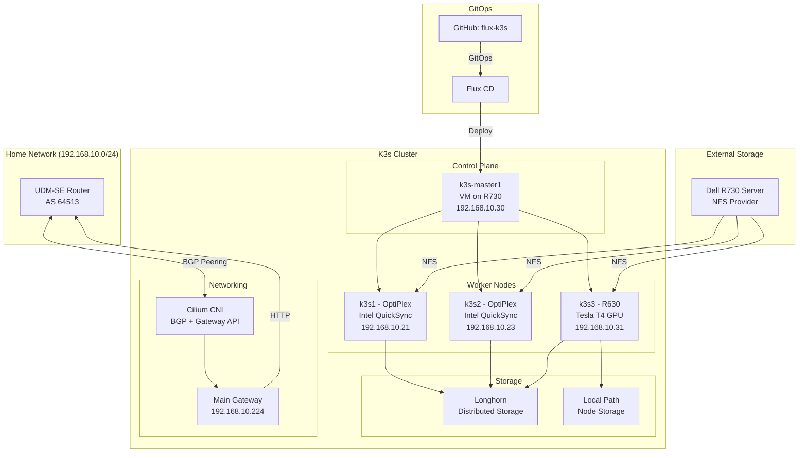

# K3s Flux GitOps Repository

This repository contains the Flux GitOps configuration for a K3s homelab cluster running media services, AI workloads, and observability stack. It uses Cilium as the CNI with BGP and Gateway API support.

## Architecture Overview



## Cluster Configuration

### Nodes
All nodes use **static IP addresses** configured in their network settings.

- **k3s-master1** (VM on R730): Control plane (192.168.10.30)
- **k3s1** (OptiPlex): Light compute worker with Intel QuickSync (192.168.10.21)
- **k3s2** (OptiPlex): Light compute worker with Intel QuickSync (192.168.10.23)
- **k3s3** (R630): GPU compute worker with NVIDIA Tesla T4, dual Xeon E5-2697A v4, 384GB RAM (192.168.10.31)

### Storage
Storage is configured with different backends for specific use cases:

- **NFS (Network Attached Storage)**: 
  - **Source**: Dell R730 server
  - **App Configs**: `/mnt/nvme_storage` - Fast NVMe-backed storage for application configurations
  - **Media Files**: `/mnt/rust/media` - Large HDD array for media libraries (30TB)
  - **Use Case**: Shared storage accessible by all nodes, ideal for media libraries
  - **Network**: Shared 2.5GbE network (potential bottleneck)

- **Longhorn (Distributed Block Storage)**:
  - **Type**: Cloud-native distributed storage with automatic replication
  - **Use Case**: Persistent volumes requiring high availability
  - **Classes**: 
    - `longhorn` - Default, available on all nodes
    - `longhorn-optane` - Ultra-fast storage (k3s3 only)
    - `longhorn-nvme` - High-performance NVMe (k3s3 only)
    - `longhorn-sas-ssd` - Standard SSD storage (k3s3 only)
  - **Status**: ✅ Fully operational on all nodes

- **Local Path (Node Storage)**:
  - **Type**: Direct node disk access, no replication
  - **Use Case**: Temporary data, caches, currently monitoring stack
  - **Note**: k3s3 has tiered local storage (Optane, NVMe, SAS SSDs)

### Important K3s Configuration

K3s requires specific configuration to work with Cilium:

```bash
# /etc/systemd/system/k3s.service on master node
--disable=servicelb    # Disable K3s built-in load balancer
--flannel-backend=none # Disable default Flannel CNI
--disable-network-policy # Cilium handles network policies
```

**Why these flags?**
- K3s includes Klipper-LB by default, which conflicts with Cilium's BGP load balancer
- Flannel must be disabled to use Cilium as the CNI
- K3s network policies are replaced by Cilium's eBPF-based policies

## Overview

Cilium is configured to:
- Act as the primary CNI for the k3s cluster
- Replace kube-proxy entirely
- Provide BGP peering with your router
- Manage LoadBalancer IP assignments from a dedicated pool
- Handle Gateway API for ingress routing
- Provide L2 announcements for local network

## Repository Structure

```
clusters/k3s-home/
├── apps/               # Application deployments
│   ├── auth/          # Authentik authentication
│   ├── media/         # Media services (Jellyfin, Plex, *arr apps)
│   ├── ai/            # AI workloads (Ollama, Open WebUI, Automatic1111)
│   └── monitoring/    # Observability stack
├── infrastructure/     # Core infrastructure (CNI, CRDs)
└── infrastructure-runtime/  # Runtime configs (storage, Gateway API)
```

## Quick Start

### Access Services
All services are accessible via HTTPS with valid Let's Encrypt certificates:
- Media services: `https://<service>.fletcherlabs.net`
- Grafana: `https://grafana.fletcherlabs.net` (admin / check SOPS secret)
- Longhorn UI: `https://longhorn.fletcherlabs.net`
- Authentik: `https://authentik.fletcherlabs.net` (needs initial setup)

### Managing the Cluster
```bash
# SSH to any node
ssh k3s1  # or k3s2, k3s3, k3s-master1

# Check cluster status
sudo kubectl get nodes
sudo kubectl get pods -A

# Force Flux reconciliation
flux reconcile kustomization <name> --with-source

# Or if flux CLI not available:
sudo kubectl annotate kustomization <name> -n flux-system \
  reconcile.fluxcd.io/requestedAt=$(date +%s) --overwrite

# List all kustomizations and their status
sudo kubectl get kustomizations -n flux-system
```

Common kustomizations: `apps`, `media`, `monitoring`, `longhorn`, `velero`

## Prerequisites

### 1. Node Labeling for BGP

**IMPORTANT**: BGP will only work on nodes that have the proper label. You must label your nodes:

```bash
kubectl label node <node-name> bgp=enabled
```

To verify your nodes are labeled:
```bash
kubectl get nodes --show-labels | grep bgp=enabled
```

### 2. Router BGP Configuration

Your router (UDM-SE) must be configured with:
- BGP enabled
- AS Number: 64513
- Neighbor IP: Your k3s node IP(s) that have `bgp=enabled` label
- Neighbor AS: 64512
- **Important**: Ensure TCP port 179 is open between router and nodes

**Note**: Cilium uses BGP to advertise LoadBalancer service IPs directly to your router, eliminating the need for MetalLB or other solutions.

## IP Address Allocation

The LoadBalancer IP pool is configured with range: `192.168.10.224` - `192.168.10.239` (192.168.10.224/28)

Current allocation:
- Gateway API LoadBalancer: `192.168.10.224`
- Services are accessed via Gateway API HTTPRoutes
- All services use `*.fletcherlabs.net` domains

**Note**: Media apps use ClusterIP services internally and are exposed via Gateway API for HTTP/HTTPS access with proper domain routing.

## Troubleshooting

### Check BGP Status

1. Verify Cilium BGP is enabled:
```bash
kubectl -n kube-system exec -it deployment/cilium-operator -- cilium bgp peers
```

2. Check if ingress LoadBalancer IPs are assigned:
```bash
kubectl get svc -n media -o wide | grep cilium-ingress
```

3. Verify BGP routes on your router:
```bash
# On UDM-SE
show ip bgp summary
show ip bgp routes
```

### Common Issues

1. **No BGP peers established**
   - Ensure nodes are labeled with `bgp=enabled`
   - Verify router BGP configuration
   - Check firewall rules allow BGP (TCP port 179)

2. **Ingress services not accessible**
   - Verify BGP routes are being advertised for ingress IPs
   - Check if ingress resources are properly configured
   - Ensure IP pool has available addresses for ingress controller

3. **Services not reachable via ingress**
   - Check Cilium operator logs: `kubectl logs -n kube-system deployment/cilium-operator`
   - Verify ingress controller is running: `kubectl get pods -n kube-system | grep cilium`
   - Check service endpoints: `kubectl get endpoints -n media`

## Service Configuration

Media apps use ClusterIP services and are exposed via Gateway API:

```yaml
# HTTPRoute example
apiVersion: gateway.networking.k8s.io/v1
kind: HTTPRoute
metadata:
  name: app-http-route
  namespace: media
spec:
  parentRefs:
    - name: main-gateway
      namespace: networking
      sectionName: https  # TLS termination
  hostnames:
    - "app.fletcherlabs.net"
  rules:
    - backendRefs:
        - name: app-service
          port: 8080
```

**Note**: Cilium Gateway API requires:
- `enable-gateway-api-alpn: "true"` for HTTP/2 and gRPC support
- `enable-gateway-api-app-protocol: "true"` for backend protocol selection

## Deployed Services

### Media Stack
- **Jellyfin**: Media server (jellyfin.fletcherlabs.net)
- **Plex**: Alternative media server (plex.fletcherlabs.net)
- **Sonarr**: TV show management (sonarr.fletcherlabs.net)
- **Radarr**: Movie management (radarr.fletcherlabs.net)  
- **Prowlarr**: Indexer management (prowlarr.fletcherlabs.net)
- **Whisparr**: Adult content management (whisparr.fletcherlabs.net)
- **SABnzbd**: Usenet downloader (sabnzbd.fletcherlabs.net)

### AI/ML Stack
- **Ollama**: LLM inference engine with llama3.2:3b
- **Open WebUI**: Chat interface for LLMs (openwebui.fletcherlabs.net)
- **Automatic1111**: Stable Diffusion WebUI (automatic1111.fletcherlabs.net)

### Infrastructure Services
- **Authentik**: Identity provider and SSO (authentik.fletcherlabs.net)
- **Longhorn**: Distributed block storage with tiered storage classes
- **Velero**: Backup and disaster recovery with MinIO backend

### Observability Stack
- **Prometheus**: Metrics collection and storage
- **Grafana**: Visualization and dashboards (grafana.fletcherlabs.net)
- **Loki**: Log aggregation
- **DCGM Exporter**: GPU metrics monitoring

## Security

- **SOPS**: Age encryption for secrets management
- **GitOps**: All changes tracked in Git, deployed by Flux
- **Network Policies**: Cilium network policies for pod-to-pod communication

## Recent Changes

### 2025-06-14
- Resolved k3s1 networking incident (initially misdiagnosed as CSI issue)
- Fixed HTTPS/TLS with proper cert-manager configuration
- Enabled Cilium Gateway API ALPN and app-protocol support
- Fixed Longhorn node scheduling for k3s3
- Completed Backblaze B2 offsite backup integration
- Major documentation overhaul with AAR (After Action Review) format

### 2025-06-13
- Completed Week 3 observability implementation
- Deployed kube-prometheus-stack with Grafana
- Added NVIDIA DCGM exporter for GPU monitoring
- Deployed Loki for centralized log aggregation
- Fixed Flux dependency chain issues

### Known Issues
- Flux reconciliation: Authentik secret missing, Intel GPU CRDs not installed
- Monitoring stack using ephemeral local-path storage (should migrate to Longhorn)
- No HA: Single control plane, single storage server

## Important Notes

1. **SOPS Age Key**: The encryption key is located at `~/.config/sops/age/keys.txt` - **BACK THIS UP!**
2. **Authentik 2FA**: Do not enable 2FA/forward auth until all infrastructure work is complete
3. **Storage Classes**: 
   - `local-path`: Default K3s local storage (no replication)
   - `longhorn`: Default replicated storage (all nodes)
   - `longhorn-optane`: Ultra-fast storage on k3s3 only
   - `longhorn-nvme`: High-performance NVMe storage (k3s3 only)
   - `longhorn-sas-ssd`: Standard SSD storage (k3s3 only)
4. **GPU Sharing**: Tesla T4 uses time-slicing (nvidia.com/gpu: 4) - no memory isolation between workloads
5. **Backups**: Velero backs up to local MinIO and offsite Backblaze B2 daily

## Documentation

For detailed documentation, see:
- [CLUSTER-SETUP.md](./CLUSTER-SETUP.md) - Comprehensive cluster documentation
- [docs/](./docs/) - Weekly implementation summaries and plans
- External docs referenced in CLUSTER-SETUP.md